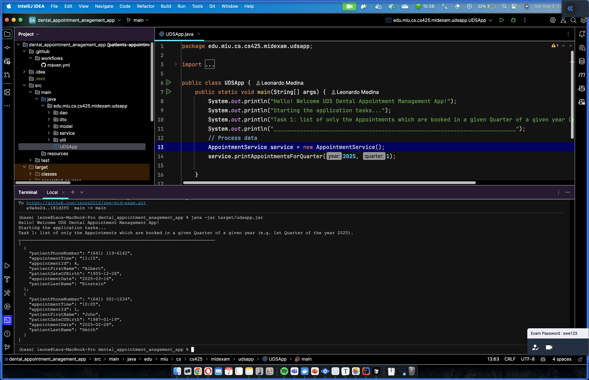
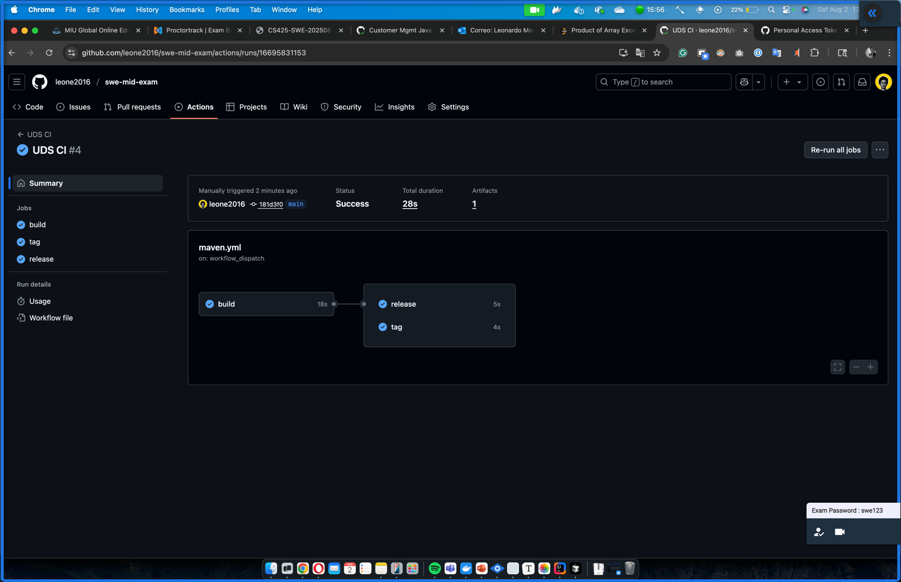
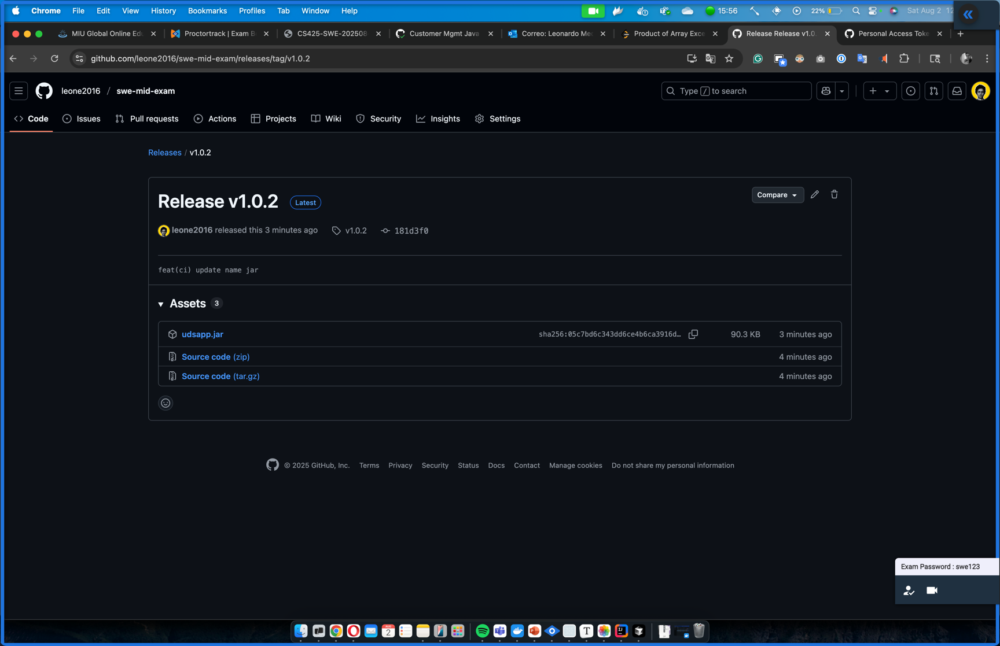

[GITHUB LEONARDO MEDINA](https://github.com/leone2016/swe-mid-exam)

# UDS Dental Appointment Management system

java version 21
#Running the project

# GITHUB CI

> [!IMPORTANT]
>
> Github workflow is a manual process, it requires manual version tag

# Release

